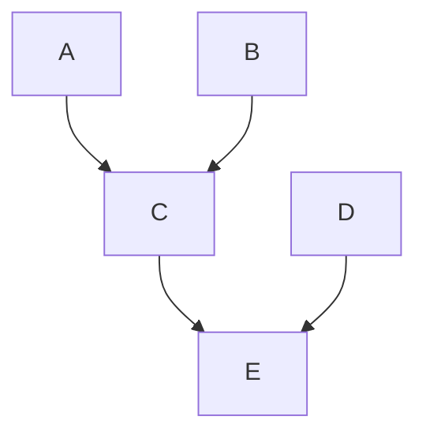

## 题24
### 题目
【2020 统考真题】现有 5 个操作 A、B、C、D 和 E, 操作 C 必须在 A 和 B 完成后执行, 操作 E 必须在C和D完成后执行, 请使用信号量的 wait ()、signal () 操作 (P、V操作描述上述操作之间的同步关系, 并说明所用信号量及其初值。
### 分析
这属于是用信号量实现前驱的问题，我们用mermaid画一下这个先后的关系图

P是申请资源，操作C的时候，要申请A和B，操作E的时候，要申请C和D，所以我们要定义这四个信号量
### 解
```c
semaphore A = B = C = D = 0;

CoBegin{ 
    A {
        做A的任务
        V(A);
    }
    B{
        B de
        V(B);
    }
    C{
        // get AB
        P(A);
        P(B);
        完成操作C
        V(C);
    }
    D {
		完成操作D;
		V(D);
    }
	E {
        P(C);
        P(D);
        完成操作E;
        V(E);
    }
}
```